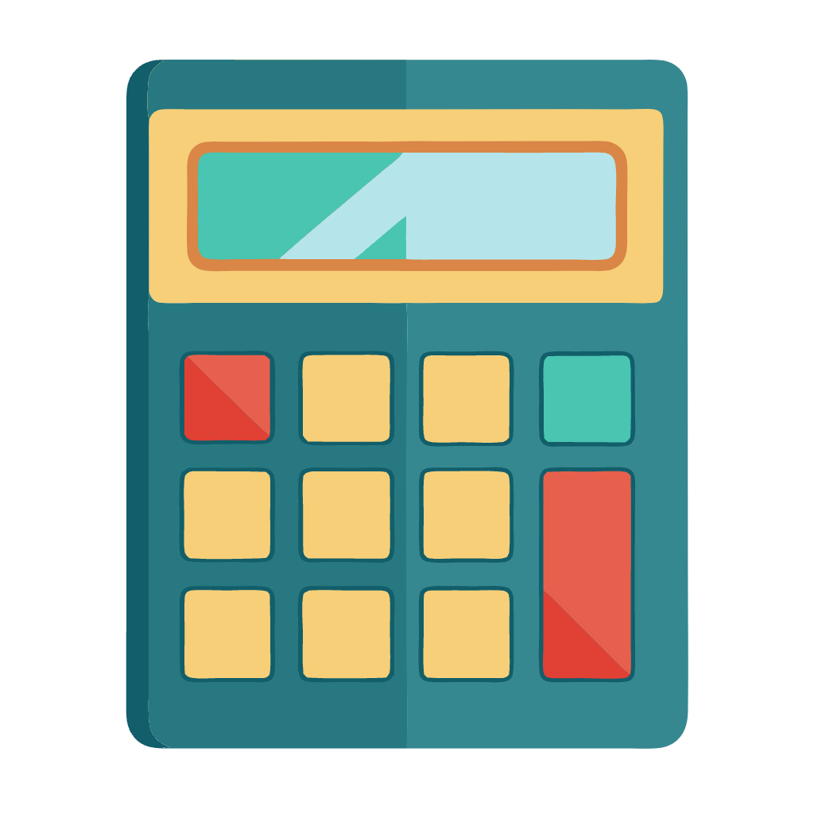

# KCalc Basic
<center>

</center>

A basic calculator written in Flutter. A propposal to replace default kcalc app for a Modern Calculator App.

The KCalc Basic Calculator app is a modern app written in Dart with Flutter that aims to be a replacement to the default KCalc KDE app. The app provides standard  calculator functionality.

## Features
- Standard Calculator functionality which offers basic operations and evaluates commands immediately as they are entered.

## To do
- Scientific Calculator functionality.
- Conversion between many units of measurement.
- Currency conversion.

## Build KCalc Basic

- Run the command ``` flutter build linux ``` to get a release package
- Activate the flutter_to_debian flutter package with the following command ``` dart pub global activate flutter_to_debian ```
- Create the Debian/Kubuntu/Ubuntu deb package: ``` flutter_to_debian ```

 ## Additional information:


<b>Version 3.19.5</b> 